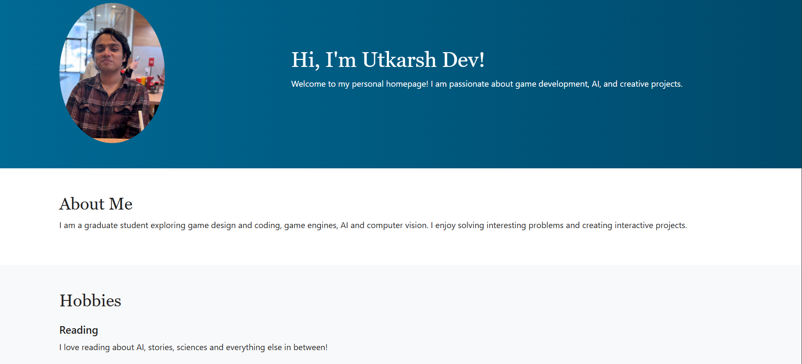
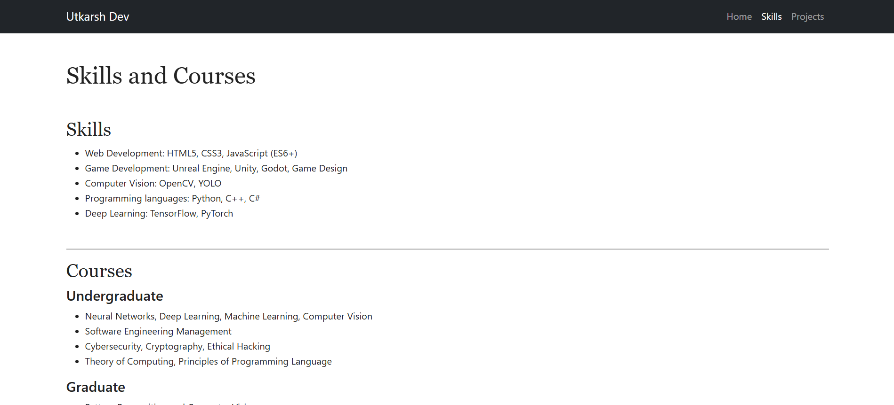
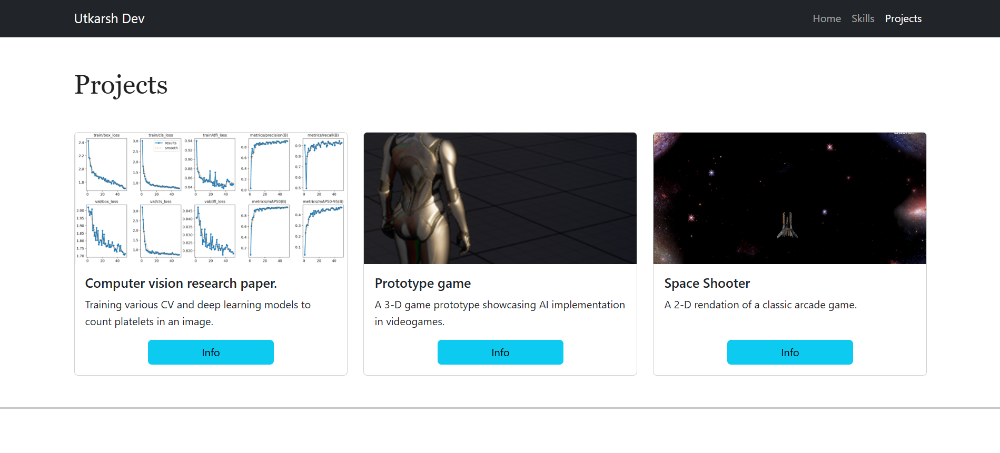

# Personal Homepage - Utkarsh Dev

This project is a **personal homepage** built using **vanilla HTML5, CSS3, and ES6+ JavaScript**.  
It was created as part of a web development assignment with the following requirements:
- Frontend only (no backend).
- No libraries or frameworks like jQuery.
- Modular JavaScript using ES6+.
- At least one creative addition to differentiate the page.

---

## 🌐 Live Preview
[Click me!](https://utkarshdev2.github.io/Personal_Homepage/)

## 📓 Class link
[WebDev class!](https://johnguerra.co/classes/webDevelopment_online_fall_2025/)
---

## 📂 Project Structure

```bash
├── index.html
├── skills.html
├── projects.html
├── css/
│   └── style.css
├── js/
│   └── script.js
├── img/
│   ├── favicon.png
│   ├── pfp2Slack.jpg
│   └── yolo-data.png
├── Screenshots/
│   ├── Screenshot-home.png
│   ├── Screenshot-modal.jpg
│   └── Screenshot-project.png
│   ├── Screenshot-project2.jpg
│   └── Screenshot-skills.png
├── LICENSE
└── README.md
```

---

## ✨ Features
- **Responsive Design**: Uses CSS and Bootstrap for layout and styling.
- **Navigation Bar**: Links that lead to Home, Skills, and Projects. On the left corner of the navbar is another way to reach home.
- **Modal Popups**: Project details open in modals built with pure JavaScript (no external libraries).
- **Favicon**: Custom favicon included with attribution.
- **Accessibility**: Semantic HTML, `alt` attributes, and keyboard support for modal closing (`Esc` key).

---

## 📑 Pages
### 1. Homepage (`index.html`)
- Introduction and welcome section.
- Profile image and short bio.

### 2. Skills (`skills.html`)
- List of technical skills.
- Undergraduate and graduate courses.

### 3. Projects (`projects.html`)
- Grid of project cards.
- Each card opens a **modal popup** with more details about the project.

---

## 🎨 Creative Addition
The **modal popup feature** is implemented using **vanilla ES6+ JavaScript**.  
- Click a project card to open details in a modal.  
- Modal can be closed by:
  - Clicking the close button.  
  - Clicking outside the modal.  
  - Pressing the `Escape` key.  

## 🤖 Use of GenAI
This project uses GenAI in the following way:
- Claude was used to create a template for 'projects.html'. This was before modal popup implementation. Additional visual tweaks were done to make it 
look uniform with the rest of the pages. "Make a projects html page for a personal homepage with cards, each card depicting a project. Bootstrap 5."
- ChatGPT was used to ask about potential ideas for the JS feature, and for understanding some concepts, like "what does MIT License mean?" "why is package.json important?"
- "Project in Progress" section in projects.html was added after page generation from AI. 

---

## ⚙️ How to Run

### Option 1: Open directly in browser
1. Clone or download the repo.
2. Open `index.html` in a modern browser.
3. Navigate through Home → Skills → Projects.  

> Note: Some browsers may block ES6 module imports via `file://`. Use Option 2 if you see errors.

### Option 2: Use a local development server
**Using VS Code Live Server:**  
1. Install the [Live Server extension](https://marketplace.visualstudio.com/items?itemName=ritwickdey.LiveServer).  
2. Open your project folder in VS Code.  
3. Right-click `index.html` → Open with Live Server.  

**Using Node.js `serve` package:**  
```bash
npm install -g serve
serve .
```
- Open the provided URL in your browser.


## 🖱️ How to Use
1. Navigation – Use the top navbar to switch between Home, Skills, and Projects.
2. Home Page – View profile picture, introduction, and hobbies.
3. Skills Page – Check technical skills and courses.
4. Projects Page – Browse project cards and click Info for modal popups with details.
5. Responsive Design – Layout adjusts for desktop, tablet, and mobile.
6. Dark Mode – (Optional) Toggle light/dark themes if implemented.

## 📸 Screenshots

- **Homepage**
  

- **Skills Page**
  

- **Projects with Modal**
  
  
  

---

## 🛠️ Technologies Used
- **HTML5**  
- **CSS3**  
- **JavaScript (ES6+)**  
- **Bootstrap 5.3** (for responsive layout only)
- **GenAI** (Claude and ChatGPT)
---

## 📜 License
This project is licensed under the **MIT License**.  
Favicon provided by [Icons8](https://icons8.com).

---

